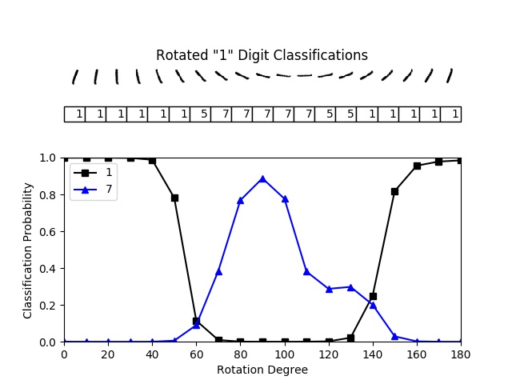

# Evidential Deep Learning to Quantify Classification Uncertainty

The purpose of this repository is to provide an easy-to-run demo using PyTorch with low computational requirements for the ideas proposed in the paper *Evidential Deep Learning to Quantify Classification Uncertainty*. The authors of the paper originally used Tensorflow in their implementation.

The paper can be accessed over at: [http://arxiv.org/abs/1806.01768](http://arxiv.org/abs/1806.01768)

Part of: [Advances in Neural Information Processing Systems 31 (NIPS 2018)](https://papers.nips.cc/book/advances-in-neural-information-processing-systems-31-2018)

## 📝 Table of Contents
- [About](#about)
- [Paper Abstract](#abstract)
- [Authors](#authors)
- [Demonstration](#demonstration)
- [License](./LICENSE)
- [Requirements](./requirements.txt)

## 🧐 About 
The purpose of this repository is to provide an easy-to-run demo using PyTorch with low computational requirements for the ideas proposed in the paper *Evidential Deep Learning to Quantify Classification Uncertainty*. The authors of the paper originally used Tensorflow in their implementation.

The paper can be accessed over at: [http://arxiv.org/abs/1806.01768](http://arxiv.org/abs/1806.01768)

Part of: [Advances in Neural Information Processing Systems 31 (NIPS 2018)](https://papers.nips.cc/book/advances-in-neural-information-processing-systems-31-2018)

## 📚 Paper Abstract 

Deterministic neural nets have been shown to learn effective predictors on a wide range of machine learning problems. However, as the standard approach is to train the network to minimize a prediction loss, the resultant model remains ignorant to its prediction confidence. Orthogonally to Bayesian neural nets that indirectly infer prediction uncertainty through weight uncertainties, we propose explicit modeling of the same using the theory of subjective logic. By placing a Dirichlet distribution on the class probabilities, we treat predictions of a neural net as subjective opinions and learn the function that collects the evidence leading to these opinions by a deterministic neural net from data. The resultant predictor for a multi-class classification problem is another Dirichlet distribution whose parameters are set by the continuous output of a neural net. We provide a preliminary analysis on how the peculiarities of our new loss function drive improved uncertainty estimation. We observe that our method achieves unprecedented success on detection of out-of-distribution queries and endurance against adversarial perturbations.

## ✍️ Authors 
Original Paper authors:
- [Murat Sensoy](https://papers.nips.cc/author/murat-sensoy-11083)
- [Lance Kaplan](https://papers.nips.cc/author/lance-kaplan-11084)
- [Melih Kandemir](https://papers.nips.cc/author/melih-kandemir-11085)

Code for this repository:
- [Douglas Brion](https://github.com/dougbrion)

## 🏁 Demonstration 

### Classification with softmax neural network

The following demonstrates how softmax based Deep Neural Networks fail when they encounter out-of-sample queries.

The test accuracy after 50 epochs is around 98.9%. Now, we want to classify a rotating digit from MNIST dataset to see how this network does for the samples that are not from the training set distribution. The following lines of codes helps us to see it.

As shown above, a neural network trained to generate softmax probabilities fails significantly when it encounters a sample that is different from the training examples. The softmax forces neural network to pick one class, even though the object belongs to an unknown category. This is demonstrated when we rotate the digit one between 60 and 130 degrees.

### Classification with uncertainty using MSE based loss

As described in the paper, a neural network can be trained to learn parameters of a Dirichlet distribution, instead of softmax probabilities. Dirichlet distributions with parameters  `α ≥ 1` behaves like a generative model for softmax probabilities (categorical distributions). It associates a likelihood value with each categorical distribution.

The figure above indicates that the proposed approach generates much smaller amount of evidence for the misclassified samples than the correctly classified ones. The uncertainty of the misclassified samples are around 0.8, while it is around 0.1 for the correctly classified ones, both for training and testing sets. This means that the neural network is very uncertain for the misclassified samples and provides certain predictions only for the correctly classified ones. In other words, the neural network also predicts when it fails by assigning high uncertainty to its wrong predictions.

### Classification with uncertainty using digamma based loss

In this section, we train neural network using the loss function described in Eq. 4 in the paper. This loss function is derived using the expected value of the cross entropy loss over the predicted Dirichlet distribution.

The figure above indicates that the neural network generates much more evidence for the correctly classified samples. As a result, it has a very low uncertainty (around zero) for the correctly classified samples, while the uncertainty is very high (around 0.7) for the misclassified samples.

### Classification with uncertainty using log based loss

In this section, we repeat our experiments using the loss function based on Eq. 3 in the paper.

